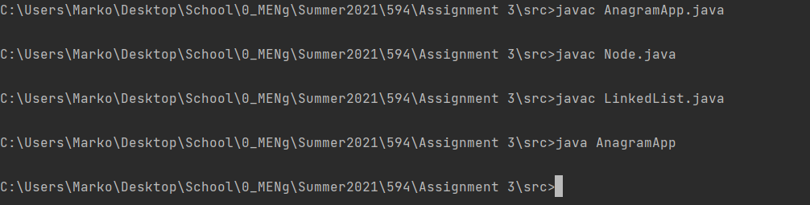
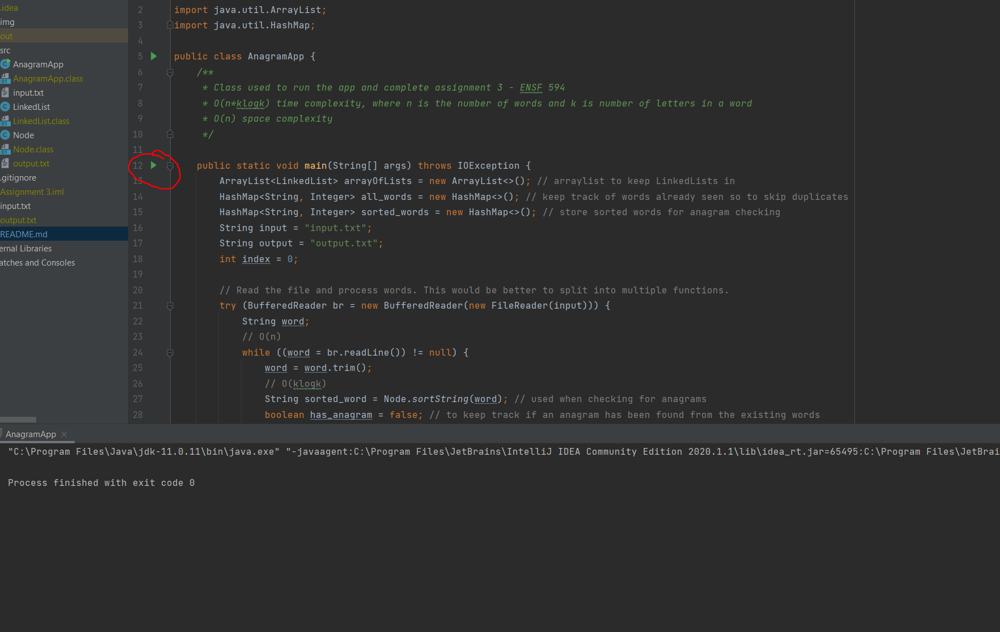

# Anagrams - ENSF 594 Assignment 3


## Table of contents

- [Summary](#summary)
- [Quick start](#quick-start)
- [What's included](#whats-included)
- [Creators](#creators)

## Summary
The solution is O(n*klog(k)) time complexity and O(n) space complexity. 

The way I achieved this was using hash maps to store sorted words as keys instead of 
looping through the entire list of linked lists to find the anagram of the word. 

When I do not find sorted word as a key of hash map, I add a new 
entry to the hash map <key: Sorted Word, val: Array index> where the value is the index of the array list at 
which I enter the new linked list with the new word. 

This way I achieve O(nklogk) instead of O(n^2klogk) time complexity at a cost of O(n) space complexity instead of
O(1) space complexity.

## Quick start

To run the code compile each .java file using javac <file_name.java> or alternatively run AnagramApp main() 
from an IDE. 

Note that input.txt is intended to be in the same directory as the other java files for the simplest
execution by the TA.

Compile as such: 



Or from within an IDE: 




## What's included

AnagramApp.java acts as the entry point. Input.txt for the assignment purposes is intended to be in the same 
directory as the java classes.
```text
src/
├── AnagramApp.java
├── LinkedList.java
├── Node.java
└── input.txt
```


## Creators

- <https://github.com/markomijovic>


